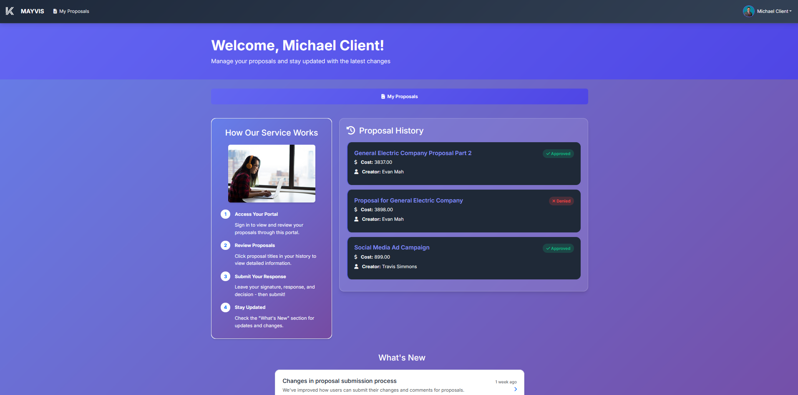
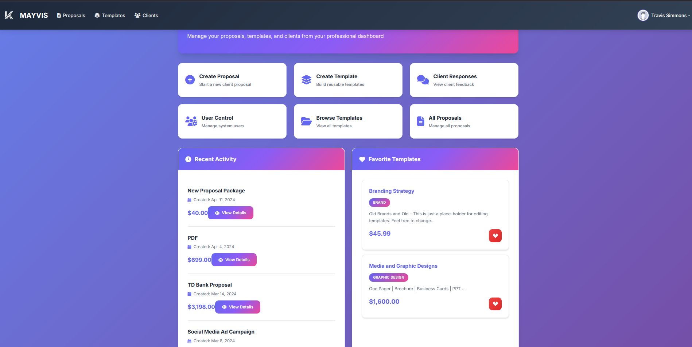
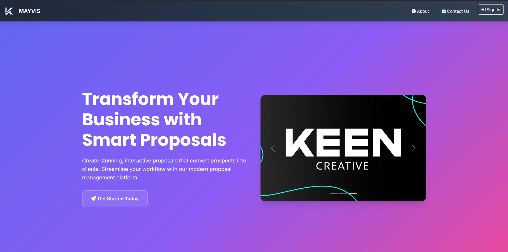

# MAYVIS – Capstone Project Presentation

Welcome! I'm Travis Simmons, and this is my team's capstone project: **MAYVIS** – a modern, full-featured proposal management web application built for Keen Creative. This project demonstrates my skills in full-stack PHP development, UI/UX design, and collaborative software engineering.

## What is MAYVIS?

MAYVIS is a web-based platform designed to streamline the creation, management, and approval of business proposals. It provides a seamless experience for both clients and employees, featuring:

- Modern, responsive design
- Secure user authentication
- Role-based dashboards
- Proposal creation, review, and approval workflows
- Template management
- Notification system

## How Does It Work?

MAYVIS allows employees to create and manage proposals, while clients can review and approve them through a secure portal. The system supports:

- User registration and profile management
- Dynamic proposal templates
- Real-time status updates and notifications
- Clean, maintainable PHP codebase for easy extensibility

## Tech Stack

- **Frontend:** HTML5, CSS3 (custom and Bootstrap), JavaScript, jQuery, FontAwesome
- **Backend:** PHP 7+
- **Database:** MySQL

## Walkthrough: Key Features (with Screenshots)

### Client Dashboard

Clients can view, review, and approve proposals in a clean, intuitive dashboard. The interface is designed for clarity and ease of use, with real-time status indicators and quick access to proposal details.

### Employee Dashboard

Employees have access to tools for creating new proposals, managing templates, and tracking client approvals. The dashboard provides a comprehensive overview of all active and past proposals.

### Landing Page

The landing page welcomes users and provides clear navigation to login or register, with a modern, branded look that reflects Keen Creative's identity.

## How to Set Up MAYVIS

### Prerequisites
- Web server with PHP support (Apache or Nginx recommended)
- MySQL or MariaDB database server
- Git (optional, for cloning the repository)

### Installation Steps
1. **Clone the Repository:**
   ```bash
   git clone https://github.com/DMIT-2590/Keen.git
   ```
   Or download the ZIP from GitHub and extract it to your server's document root.

2. **Set Up the Database:**
   - Ensure MySQL/MariaDB is running.
   - Navigate to the `database/` directory.
   - Import `schema.sql` into your database using your preferred SQL client.

3. **Configure the Application:**
   - Update database connection settings in `connect.php` (and `login/config/db.php` if present) to match your environment.
   - Enter your root URL (as in `includes/header-new.php`) in the `$url` string before `/login` (see line 29).
   - Update email credentials in the "// creating email" and "//email content" sections. For Gmail, create an app password: [Google App Passwords](https://support.google.com/accounts/answer/185833?hl=en).
   - Repeat email setup in `send-notification.php` under the `send_to_client` and `proposal_update` functions as needed.

4. **Configure Your Web Server:**
   - For Apache: Enable `mod_php` or `php-fpm`.
   - For Nginx: Ensure PHP-FPM is installed and configured.

5. **Access the Application:**
   - Open your browser and navigate to your server's root URL.

## About the Project

MAYVIS was developed as a capstone for Keen Creative by TravisESimmons, Evan Mah, Jeb Gallarde, and Melody Mirand. It showcases modern PHP development, collaborative teamwork, and a focus on real-world business needs.

---

Thank you for checking out MAYVIS! If you have questions or want to see more, feel free to contact me or explore the codebase.
